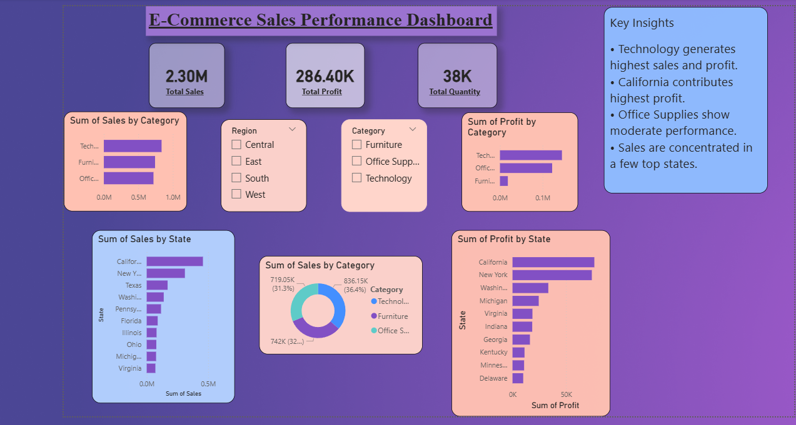

# E-Commerce Sales Analysis Dashboard

## Overview
This project analyzes e-commerce sales performance using Power BI and the Superstore dataset.

## Tools Used
- Power BI
- SQL
- CSV Dataset

## Project Files

### Dashboard
- Ecommerce_Sales_Dashboard.pbix
- dashboard_final.png

### Dataset
- SampleSuperstore.csv

## SQL Analysis

- 01_data_exploration.sql
- 02_business_analysis.sql
- 03_sales_trends.sql
- 04_top_customers.sql
- 05_regional_performance.sql
- 06_profitability_analysis.sql

## Key Insights
- Category-wise sales analysis
- Profit analysis
- Regional performance tracking
- Sales trends and KPIs

## Dashboard Preview

See:
dashboard/dashboard_final.png

